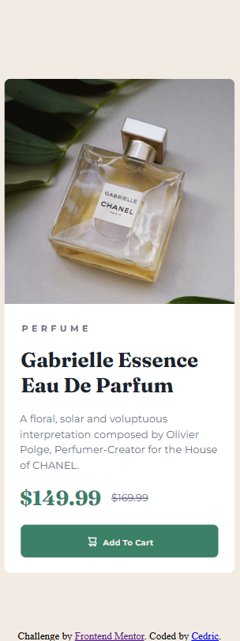
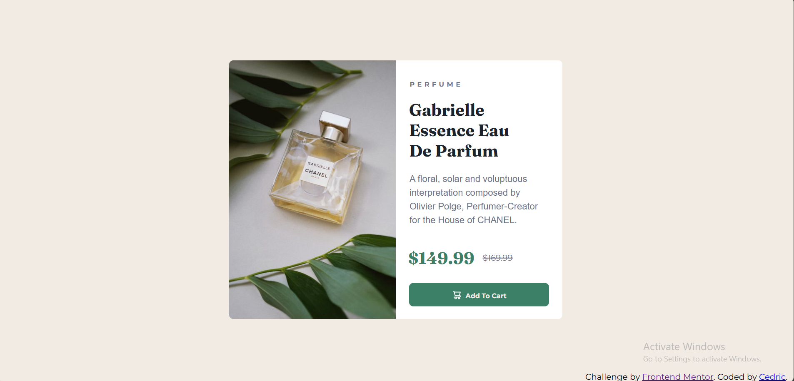

# Frontend Mentor - Product preview card component solution

This is a solution to the [Product preview card component challenge on Frontend Mentor](https://www.frontendmentor.io/challenges/product-preview-card-component-GO7UmttRfa).  
Frontend Mentor challenges help you improve your coding skills by building realistic projects.  

---

## Table of contents

- [Overview](#overview)  
  - [The challenge](#the-challenge)  
  - [Screenshot](#screenshot)  
  - [Links](#links)  
- [My process](#my-process)  
  - [Built with](#built-with)  
  - [The process](#the-process)  
  - [What I learned](#what-i-learned)  
  - [Continued development](#continued-development)  
  - [Useful resources](#useful-resources)  
- [Author](#author)  
- [Acknowledgments](#acknowledgments)  

---

## Overview

### The challenge

Users should be able to:

- View the optimal layout depending on their device's screen size  
- See hover and focus states for interactive elements  

---

### Screenshot

  


---

### Links

- **Solution URL:** [https://www.frontendmentor.io/solutions/product-preview-card-component](https://www.frontendmentor.io/solutions/product-preview-card-component)  
- **Live Site URL:** [https://cedric-celestino.github.io/product-preview-card-component/](https://cedric-celestino.github.io/product-preview-card-component/)

---

## My process

### Built with

- Semantic **HTML5** markup  
- **CSS custom properties**  
- **Flexbox**  
- **Mobile-first workflow**  
- **Clamp()** for responsive scaling  

---

### The process

I took a lot of time incorporating the **clamp()** method, and it turned out to be very useful for making responsive designs. It allowed me to maintain consistent spacing and typography across different screen sizes without having to rely too much on multiple media queries.  

---

### What I learned

Using the **clamp()** method on widths, font sizes, and paddings is actually very useful once you get the hang of it. It makes layouts flexible and scalable on both small and large screens.  

Here’s one of my code snippets that uses these techniques:

```css
.product-card {
  border-radius: 0.6em;
  margin: auto auto;
  max-width: 30rem;
  width: calc(100vw - 1rem);
  background-color: var(--neutral-color4);
}
```

### Continued development

In future projects, I want to continue focusing on:

- Exploring **CSS Grid** for more complex layouts  
- Improving **typography scaling** for larger displays  
- Experimenting more with **clamp()** for fluid spacing and sizing  

---

### Useful resources

- [**freeCodeCamp**](https://www.freecodecamp.org/) – This is where I learned how to use HTML and CSS effectively. Their lessons were beginner-friendly and helped me build a solid foundation in web development.  

---

## Author

- **Website** – [Cedric](https://github.com/Cedric-Celestino)  
- **Frontend Mentor** – [@Cedric-Celestino](https://www.frontendmentor.io/profile/Cedric-Celestino)  

---

## Acknowledgments

Special thanks to **Frontend Mentor** for providing such a great platform to practice real-world web development challenges.  
It helped me improve my responsive design and CSS layout skills tremendously.  
